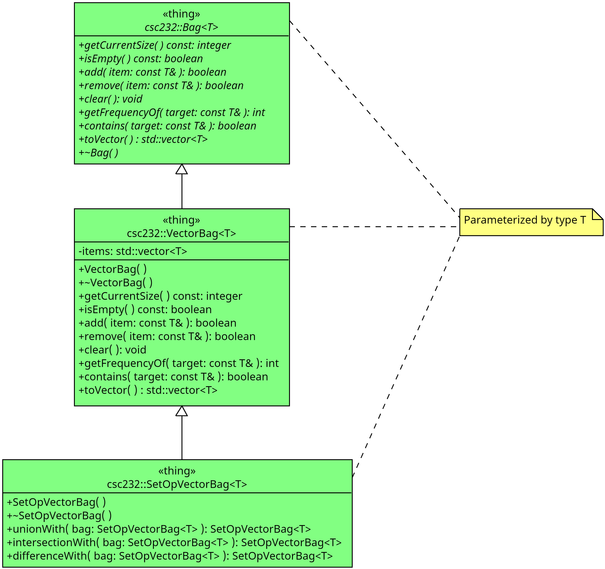

# HW01 - Extending the Bag ADT

In this assignment, the student shall add operations, i.e., _extend_ the functionality of the `VectorBag` (first encountered in Lab 01) by adding operations above and beyond those found in the `Bag` interface.



## Due Date

This assignment is due by 11:59:59 PM on Saturday, 18 February 2023.

## Background

As presented in [Geeks for Geeks](https://www.geeksforgeeks.org/inheritance-in-c/),

> The capability of a class to derive properties and characteristics from another class is called **Inheritance**. Inheritance is one of the most important features of Object-Oriented Programming.
>
> Inheritance is a feature or a process in which, new classes are created from the existing classes. The new class created is called “derived class” or “child class” and the existing class is known as the “base class” or “parent class”. The derived class now is said to be inherited from the base class.
>
> When we say derived class inherits the base class, it means, the derived class inherits all the properties of the base class, without changing the properties of base class and may add new features to its own. These new features in the derived class will not affect the base class. The derived class is the specialized class for the base class.

### Advanced Reading

- General > Files > Class Materials > Setting Up WSL for CSC232.pdW
- Walls & Mirrors, Chapter 1: Data Abstraction
  - Exercises 6, 7 & 8
  - Programming Problem 6

## Objectives

Upon successful completion of this assignment, the student has

- gained experience in extending a class hierarchy
- defined operations in terms of existing operations
- learned how to easily encapsulate their classes in a custom namespace

## Tasks

In this assignment, you'll be working on Programming Problem 6 from Chapter
1 of our textbook. This problem refers back to Exercises 6-8 in the same
chapter and repeated below:

### Set Operations with Bags

#### Union

> The _union_ of two bags is a new bag containing the combined contents of the
> original two bags. Design and specify a method `unionWith` for the ADT bag
> that returns as a new bag the union of the bag receiving the call to the
> method and the bag that is the method’s one argument. Include sufficient
> comments to fully specify the method.
>
> Note that the union of two bags might contain duplicate items. For example,
> if object x occurs five times in one bag and twice in another, the union of
> these bags contains x seven times. Specifically, suppose that `bag1` and `bag2`
> are bags; `bag1` contains the strings `a`, `b`, and `c`; and `bag2` contains
> the strings `b`, `b`, `d`, and `e`. The expression `bag1.unionWith(bag2)`
> returns a bag containing the strings `a`, `b`, `b`, `b`, `c`, `d`, and `e`.
> Note that `unionWith` does not affect the contents of `bag1` and `bag2`.

#### Intersection

> The _intersection_ of two bags is a new bag containing the entries that occur
> in both of the original two bags. Design and specify a method
> `intersectionWith` for the ADT bag that returns as a new bag the
> intersection of the bag receiving the call to the method and the bag that is
> the method’s one argument. Include sufficient comments to fully specify the
> method.
>
> Note that the intersection of two bags might contain duplicate items. For
> example, if object `x` occurs five times in one bag and twice in another, the
> intersection of these bags contains `x` two times. Specifically, suppose that
> `bag1` and `bag2` are bags; `bag1` contains the strings `a`, `b`, and `c`; and
> `bag2` contains the strings `b`, `b`, `d`, and `e`. The expression
> `bag1.intersectionWith(bag2)` returns a bag containing only the string `b`.
> Note that intersection does not affect the contents of `bag1` and `bag2`.

#### Difference

> The _difference_ of two bags is a new bag containing the entries that would be
> left in one bag after removing those that also occur in the second. Design and
> specify a method `differenceWith` for the ADT bag that returns as a new bag
> the difference of the bag receiving the call to the method and the bag that is
> the method’s one argument. Include sufficient comments to fully specify the
> method.
>
> Note that the difference of two bags might contain duplicate items. For
> example, if object `x` occurs five times in one bag and twice in another, the
> difference of these bags contains `x` three times. Specifically, suppose that
> `bag1` and `bag2` are bags; `bag1` contains the strings `a`, `b`, and `c`; and
> `bag2` contains the strings `b`, `b`, `d`, and `e`. The expression
> `bag1.differenceWith(bag2)` returns a bag containing only the strings `a` and
> `c`.
> Note that difference does not affect the contents of `bag1` and `bag2`.

We shall develop these methods in a subclass of the `VectorBag` class with
the following tasks:

1. Task 1: Declare the `SetOpVectorBag` subclass of the `VectorBag` class
2. Task 2: Define the `unionWith( )` operation
3. Task 3: Define `instersectionWith( )` operation
4. Task 4: Define `differenceWith( )` operation
5. Task 5: Encapsulate class hierarchy in the `csc232` namespace

### Task 1: Declaring the `SetOpVectorBag` class

In this task we declare our new subclass of the `VectorBag` class.

#### Discussion

This task requires a very specific syntax for a class declaration. The
following rules **must be** adhered to in order for the first set of unit
test suite to pass.

1. Your template declaration (e.g., `template <typename...`) and class
   declaration (e.g., `class foo...`) are on two separate lines, with no blank
   space in between them. For example:

   ```c++
   template <typename T>
   class foo : public bar<T>
   {
   public:
       foo( ) = default; // explicitly define default construct
       ~f( ) = default;  // explicitly define default destructor
   };
   ```

2. Your template parameter must be as shown above, simply `T`
3. You must have one space character in between each element of the declarations
4. You must match the spelling and case of the class you'll be asked to
   declare in this task.

Now on to the steps to take for this task.

1. Open the file named `set-op-vector-bag.h` and look for the first `TODO`.
   At this point, just make a "bare-bones" declaration similar to the one shown
   in the rules above. That is, only a template declaration, class
   declaration with an empty body:

   ```c++
   template <typename T>
   class SetOpVectorBag : public VectorBag<T>
   {
   public:
       SetOpVectorBag( ) = default;
       ~SetOpVectorBag( ) = default;
   };
   ```

2. When you have completed this task, toggle the `SKIP_TESTING_TASK_1` macro from `TRUE` to `FALSE`.
3. Build and execute the `test_task1` target to test your solution (or run `ctest`).
4. When all the tests for this task pass, commit and push your changes to
   GitHub.

### Task 2: Define the `unionWith( )` operation

In this task, we define the `unionWith()` operation.

#### Discussion

In this task, we actually set about extending the `VectorBag<T>` template class. We begin with the `unionWith()` operation. Let's discuss the use of this operation first.

```c++
SetOpVectorBag<string> a{ };
SetOpVectorBag<string> b{ };
// ... populate bags with items
a.add( "a" ); a.add( "b" ); a.add( "c" );
b.add( "b" ); b.add( "b" ); b.add( "d" ); b.add( "e" );
SetOpVectorBag<string> c = a.unionWith( b );
// c = { "a", "b", "c", "b", "b", "d", "e" }
```

This is a new method to be added to the `SetOpVectorBag<T>` class declaration. Take a look at how it's used and note

- The operation returns something; since whatever it is returning is getting assigned to an instance of `SetOpVectorBag<T>` (i.e., `c`), we can infer that the return type is `SetOpVectorBag<T>`.
- The operation is given an argument (i.e., `b`); look at the argument's declaration, we can infer that  the parameter's type is also `SetOpVectorBag<T>`.
- There are two bags involved in this operation:
  - The receiver of the message (i.e., `a`)
  - The argument passed along with this message (i.e., `b`)

Note that this new method must be declared as `public` if we are to access it as shown above. All this analysis and design thus leads to the following change to our template class declaration:

```c++
// In set-op-vector-bag.h
template <typename T>
class SetOpVectorBag : public VectorBag<T>
{
public:
    SetOpVectorBag( ) = default;
    ~SetOpVectorBag( ) = default;
    
    SetOpVectorBag<T> unionWith( SetOpVectorBag<T> rhs );
};
```

And we define this method in the `set-op-vector-bag.cpp` source file:

```c++
// In set-op-vector-bag.cpp
template <typename T>
SetOpVectorBag<T> SetOpVectorBag<T>::unionWith( SetOpVectorBag<T> rhs )
{
    SetOpVectorBag<T> result;
    
    // Use bag operations to populate result with appropriate values
    // Note: Directly referring to an inherited operation is invoking the
    // receiver object's method, e.g.,
    // int size = getCurrentSize(); // this is the size of this bag
    // int otherSize = rhs.getCurrentSize(); // this is the size of the argument
    
    return result;
}
```

Let's get started on this task:

1. Open the `set-op-vector-bag.h` header file and modify your class declaration by adding the new operation:

   ```c++
   template <typename T>
   class SetOpVectorBag : public VectorBag<T>
   {
   public:
       SetOpVectorBag( ) = default;
       ~SetOpVectorBag( ) = default;
   
       SetOpVectorBag<T> unionWith( SetOpVectorBag<T> rhs );
   };
   ```
2. Now open the `set-op-vector-bag.cpp` source file and implement this method using the skeleton presented in the task discussion above.
3. When you have completed this task, toggle the `SKIP_TESTING_TASK_2` macro from `TRUE` to `FALSE`.
4. Build and execute the `test_task2` target to test your solution (or run `ctest`).
5. When all the tests for this task pass, commit and push your changes to GitHub.

### Task 3: Define `instersectionWith( )` operation

In this task, we define the `intersectionWith()` operation.

#### Discussion

In this task, we continue to extend the `VectorBag<T>` template class by adding the `intersectionWith()` operation. Let's discuss the use of this operation first.

```c++
SetOpVectorBag<string> a{ };
SetOpVectorBag<string> b{ };
// ... populate bags with items
a.add( "a" ); a.add( "b" ); a.add( "c" );
b.add( "b" ); b.add( "b" ); b.add( "d" ); b.add( "e" );
SetOpVectorBag<string> c = a.intersectionWith( b );
// c = { "b" }
```

This is a new method to be added to the `SetOpVectorBag<T>` class declaration. Take a look at how it's used and note

- The operation returns something; since whatever it is returning is getting assigned to an instance of `SetOpVectorBag<T>` (i.e., `c`), we can infer that the return type is `SetOpVectorBag<T>`.
- The operation is given an argument (i.e., `b`); look at the argument's declaration, we can infer that  the parameter's type is also `SetOpVectorBag<T>`.
- There are two bags involved in this operation:
    - The receiver of the message (i.e., `a`)
    - The argument passed along with this message (i.e., `b`)

The last bullet is notable in that the definition of this operation will access either the receiver's methods or the arguments methods (or both) in order to fulfill the requirements of this method.

Finally, note that this new method must be declared as `public` if we are to access it as shown above. All this analysis and design thus leads to the following change to our template class declaration:

```c++
template <typename T>
class SetOpVectorBag : public VectorBag<T>
{
public:
    SetOpVectorBag( ) = default;
    ~SetOpVectorBag( ) = default;
    
    SetOpVectorBag<T> unionWith( SetOpVectorBag<T> rhs );
    SetOpVectorBag<T> intersectionWith( SetOpVectorBag<T> rhs );
};
```

And we define this method in the `set-op-vector-bag.cpp` source file:

```c++
// In set-op-vector-bag.cpp
template <typename T>
SetOpVectorBag<T> SetOpVectorBag<T>::intersectionWith( SetOpVectorBag<T> rhs )
{
    SetOpVectorBag<T> result;
    
    // Use bag operations to populate result with appropriate values
    // Note: Directly referring to an inherited operation is invoking the
    // receiver object's method, e.g.,
    // int size = getCurrentSize(); // this is the size of this bag
    // int otherSize = rhs.getCurrentSize(); // this is the size of the argument
    
    return result;
}
```

Let's get started on this task:

1. Open the `set-op-vector-bag.h` header file and modify your class declaration by adding the new operation:

   ```c++
   template <typename T>
   class SetOpVectorBag : public VectorBag<T>
   {
   public:
       SetOpVectorBag( ) = default;
       ~SetOpVectorBag( ) = default;
   
       SetOpVectorBag<T> unionWith( SetOpVectorBag<T> rhs );
       SetOpVectorBag<T> intersectionWith( SetOpVectorBag<T> rhs );
   };
   ```
2. Now open the `set-op-vector-bag.cpp` source file and implement this method using the skeleton presented in the task discussion above.
3. When you have completed this task, toggle the `SKIP_TESTING_TASK_3` macro from `TRUE` to `FALSE`.
4. Build and execute the `test_task3` target to test your solution (or run `ctest`).
5. When all the tests for this task pass, commit and push your changes to GitHub.

### Task 4: Define `differenceWith( )` operation

In this task, we define the `differenceWith()` operation.

#### Discussion

In this task, we continue to extend the `VectorBag<T>` template class by adding the `intersectionWith()` operation. Let's discuss the use of this operation first.

```c++
SetOpVectorBag<string> a{ };
SetOpVectorBag<string> b{ };
// ... populate bags with items
a.add( "a" ); a.add( "b" ); a.add( "c" );
b.add( "b" ); b.add( "b" ); b.add( "d" ); b.add( "e" );
SetOpVectorBag<string> c = a.differenceWith( b );
// c = { "a", "c" }
```

This is a new method to be added to the `SetOpVectorBag<T>` class declaration. Take a look at how it's used and note

- The operation returns something; since whatever it is returning is getting assigned to an instance of `SetOpVectorBag<T>` (i.e., `c`), we can infer that the return type is `SetOpVectorBag<T>`.
- The operation is given an argument (i.e., `b`); look at the argument's declaration, we can infer that  the parameter's type is also `SetOpVectorBag<T>`.
- There are two bags involved in this operation:
    - The receiver of the message (i.e., `a`)
    - The argument passed along with this message (i.e., `b`)

The last bullet is notable in that the definition of this operation will access either the receiver's methods or the arguments methods (or both) in order to fulfill the requirements of this method.

Finally, note that this new method must be declared as `public` if we are to access it as shown above. All this analysis and design thus leads to the following change to our template class declaration:

```c++
template <typename T>
class SetOpVectorBag : public VectorBag<T>
{
public:
    SetOpVectorBag( ) = default;
    ~SetOpVectorBag( ) = default;
    
    SetOpVectorBag<T> unionWith( SetOpVectorBag<T> rhs );
    SetOpVectorBag<T> intersectionWith( SetOpVectorBag<T> rhs );
    SetOpVectorBag<T> differenceWith( SetOpVectorBag<T> rhs );
};
```

And we define this method in the `set-op-vector-bag.cpp` source file:

```c++
// In set-op-vector-bag.cpp
template <typename T>
SetOpVectorBag<T> SetOpVectorBag<T>::differenceWith( SetOpVectorBag<T> rhs )
{
    SetOpVectorBag<T> result;
    
    // Use bag operations to populate result with appropriate values
    // Note: Directly referring to an inherited operation is invoking the
    // receiver object's method, e.g.,
    // int size = getCurrentSize(); // this is the size of this bag
    // int otherSize = rhs.getCurrentSize(); // this is the size of the argument
    
    return result;
}
```

Let's get started on this task:

1. Open the `set-op-vector-bag.h` header file and modify your class declaration by adding the new operation:

   ```c++
   template <typename T>
   class SetOpVectorBag : public VectorBag<T>
   {
   public:
       SetOpVectorBag( ) = default;
       ~SetOpVectorBag( ) = default;
   
       SetOpVectorBag<T> unionWith( SetOpVectorBag<T> rhs );
       SetOpVectorBag<T> intersectionWith( SetOpVectorBag<T> rhs );
       SetOpVectorBag<T> differenceWith( SetOpVectorBag<T> rhs );
   };
   ```
2. Now open the `set-op-vector-bag.cpp` source file and implement this method using the skeleton presented in the task discussion above.
3. When you have completed this task, toggle the `SKIP_TESTING_TASK_4` macro from `TRUE` to `FALSE`.
4. Build and execute the `test_task4` target to test your solution (or run `ctest`).
5. When all the tests for this task pass, commit and push your changes to GitHub.

### Task 5: Encapsulate class hierarchy in the `csc232` namespace

Looking back at the UML Class Diagram at the beginning of this README, we note that each of the classes in the class hierarchy actually appear to be members of the `csc232` namespace. In this task, we make that happen.

#### Discussion

While unlikely in today's programming exercise, it _is_ possible that we come up with a class name that is common enough that it might clash with another similarly named class pulled in by some dependency in our project. To help mitigate this name clash, we can encapsulate our classes within a namespace. For us, we'll create a namespace named `csc232` to do just that.

Creating a namespace is easy; just use the keyword `namespace` followed by an identifier (of your choice) and then provide a pair of parentheses to define the scope of this namespace:

```c++
namespace csc232
{
    
}
```

If we declare a class in that namespace, as in

```c++
namespace csc232
{
    class Foo {};
}
```

Then, when we want to create an instance of that class, we must provide context:

```c++
csc232::Foo bar{ }; // creates an instance of csc232::Foo named bar
```

We can shorten our typing with a using clause as well:

```c++
using csc232::Foo;

Foo bar{ }; // creates an instance of csc232::Foo named bar
```

1. Open up the `bag.h` header file and put the `Bag<T>` template class declaration inside a namespace named `csc232`.
2. Next, do the same thing to the `VectorBag<T>` template class declaration found in `vector-bag.h`. 
3. So that the definitions found in `vector-bag.cpp` are still properly defined, add a `using` clause to the beginning of the file (on a line after the `#include "vector-bag.h"`):

   ```c++
   using csc232::VectorBag;
   ```
4. Next, do the same thing to the `SetOpVectorBag<T>` template class declaration found in `set-op-vector-bag.h`.
5. So that the definitions found in `set-op-vector-bag.cpp` are still properly defined, add a using clause to the beginning of the file (on a line after the `#include "set-op-vector-bag.h"`):

   ```c++
   using csc232::SetOpVectorBag;
   ```
   
6. Build and execute the `test_task5` target to test your solution (or run `ctest`).
7. When all the tests for this task pass, commit and push your changes to GitHub.

## Submission Details

Before submitting your assignment, be sure you have pushed all your changes to GitHub. If this is the first time you're pushing your changes, the push command will look like:

```bash
git push -u origin develop
```

If you've already set up remote tracking (using the `-u origin develop` switch), then all you need to do is type:

```bash
git push
```

As usual, prior to submitting your assignment on Blackboard, be sure that you have committed and pushed your final changes to GitHub. Once your final changes have been pushed, create a pull request that seeks to merge the changes in your `develop` branch into your `trunk` branch. Once your pull request has been created, submit the URL of your assignment _repository_ (i.e., _not_ the URL of the pull request) on the Teams Assignment. Please note: the timestamp of the submission on Teams is used to assess any late penalties if and when warranted, _not_ the date/time you create your pull request. **No exceptions will be granted for this oversight**.

### Grading Rubric

This assignment is worth **3 points**.

| Criteria           | Exceeds Expectations         | Meets Expectations                  | Below Expectations                  | Failure                                        |
|--------------------|------------------------------|-------------------------------------|-------------------------------------|------------------------------------------------|
| Pull Request (20%) | Submitted early, correct url | Submitted on-time; correct url      | Incorrect URL                       | No pull request was created or submitted       |
| Code Style (20%)   | Exemplary code style         | Consistent, modern coding style     | Inconsistent coding style           | No style whatsoever or no code changes present |
| Correctness^ (60%) | All unit tests pass          | At least 80% of the unit tests pass | At least 60% of the unit tests pass | Less than 50% of the unit tests pass           |

^ _The DocTest unit runner will calculate the correctness points based purely on the fraction of tests passed_.

### Late Penalty

- In the first 24-hour period following the due date, this homework will be penalized 1 point meaning the grading starts at 4 (out of 5 total possible) points.
- In the second 24-hour period following the due date, this lab will be penalized 2 points meaning the grading starts at 3 (out of 5 total possible) points.
- After 48 hours, the assignment will not be graded and thus earns no points, i.e., 0 out of 5 possible points.

NOTE: If the assignment is submitted by the due date, an opportunity will exist for a second submission whose grade will be averaged with your first graded (on-time) submission. This opportunity only is applicable if the original due date was met on the first submission.
